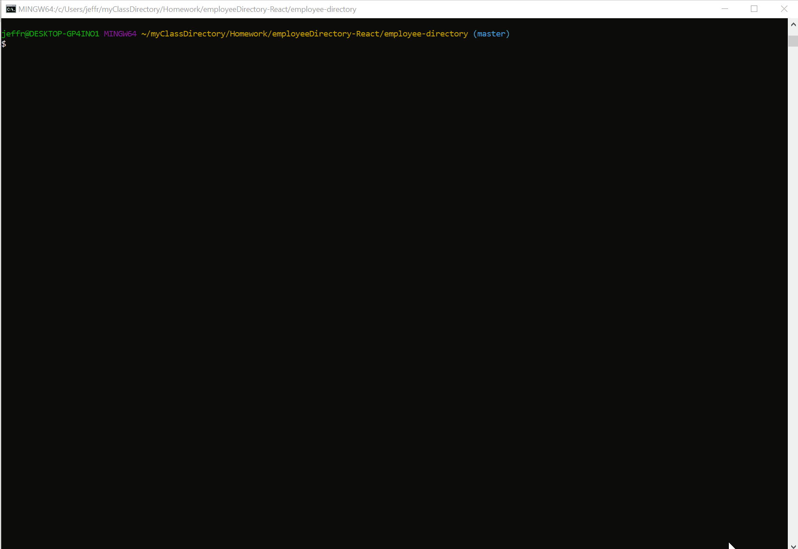

# Employee Directory (React)

Jeffrey Adamo  
UW Full Stack BootCamp - Week 19   
[Employee Directory (React)](https://jeffreyadamo.github.io/employeeDirectory-React/) at GitHub Pages  
  
***

  

## Description

 Search for employees by their first name using a search box to filter a list of 200 employees. The user can also sort alphabetically by first name. This application is designed using React's JSX JavaScript library.

Features include:
* React JSX JavaScript library
* Setting state
* Sorting array of objects alphabetically
* Searching array of objects using state


### User Story
```
 AS AN employee manager 
 I WANT TO be able to view my entire employee directory at once
 SO THAT I have quick access to their information 
 ```
## Table of Contents

* [Installation](#installation)

* [Usage](#usage)

* [License](#license)

* [Contributing](#contributing)

* [Tests](#tests)

* [Questions](#questions)

* [React](#react)

## Installation

#### Please run the following for local hosting:

* Clone from the [GitHub repo](https://github.com/jeffreyadamo/employeeDirectory-React)  
* run **npm install** in the cloned directory
* run **npm start**


## Usage

Visit [EmployeeDirectory on GitHubPages](https://jeffreyadamo.github.io/employeeDirectory-React/) or run **npm start** to load the React application on localhost 3000. 

The user should be able to  
1) Sort the table by employee's first name
2) Filter the users by first name
## License


## Contributing

Leave an issue at my GitHub page.

## Tests

### To run tests, run the following command:


none


## Questions

For questions, open an issue or contact my GitHub  


    

@ [jeffreyadamo](http://www.github.com/jeffreyadamo)  

<hr/> 

## React
This project was bootstrapped with [Create React App](https://github.com/facebook/create-react-app).

## Available Scripts

In the project directory, you can run:

### `npm start`

Runs the app in the development mode.<br />
Open [http://localhost:3000](http://localhost:3000) to view it in the browser.

The page will reload if you make edits.<br />
You will also see any lint errors in the console.

### `npm test`

Launches the test runner in the interactive watch mode.<br />
See the section about [running tests](https://facebook.github.io/create-react-app/docs/running-tests) for more information.

### `npm run build`

Builds the app for production to the `build` folder.<br />
It correctly bundles React in production mode and optimizes the build for the best performance.

The build is minified and the filenames include the hashes.<br />
Your app is ready to be deployed!

See the section about [deployment](https://facebook.github.io/create-react-app/docs/deployment) for more information.

### `npm run eject`

**Note: this is a one-way operation. Once you `eject`, you can’t go back!**

If you aren’t satisfied with the build tool and configuration choices, you can `eject` at any time. This command will remove the single build dependency from your project.

Instead, it will copy all the configuration files and the transitive dependencies (webpack, Babel, ESLint, etc) right into your project so you have full control over them. All of the commands except `eject` will still work, but they will point to the copied scripts so you can tweak them. At this point you’re on your own.

You don’t have to ever use `eject`. The curated feature set is suitable for small and middle deployments, and you shouldn’t feel obligated to use this feature. However we understand that this tool wouldn’t be useful if you couldn’t customize it when you are ready for it.

## Learn More

You can learn more in the [Create React App documentation](https://facebook.github.io/create-react-app/docs/getting-started).

To learn React, check out the [React documentation](https://reactjs.org/).

### Code Splitting

This section has moved here: https://facebook.github.io/create-react-app/docs/code-splitting

### Analyzing the Bundle Size

This section has moved here: https://facebook.github.io/create-react-app/docs/analyzing-the-bundle-size

### Making a Progressive Web App

This section has moved here: https://facebook.github.io/create-react-app/docs/making-a-progressive-web-app

### Advanced Configuration

This section has moved here: https://facebook.github.io/create-react-app/docs/advanced-configuration

### Deployment

This section has moved here: https://facebook.github.io/create-react-app/docs/deployment

### `npm run build` fails to minify

This section has moved here: https://facebook.github.io/create-react-app/docs/troubleshooting#npm-run-build-fails-to-minify


 